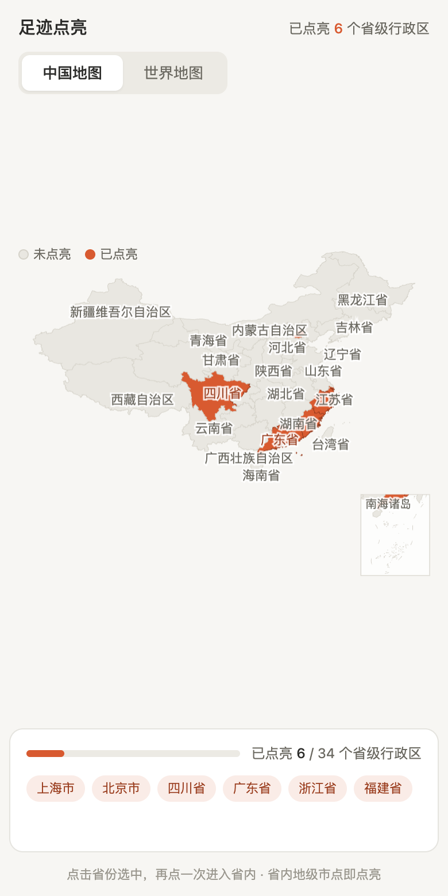
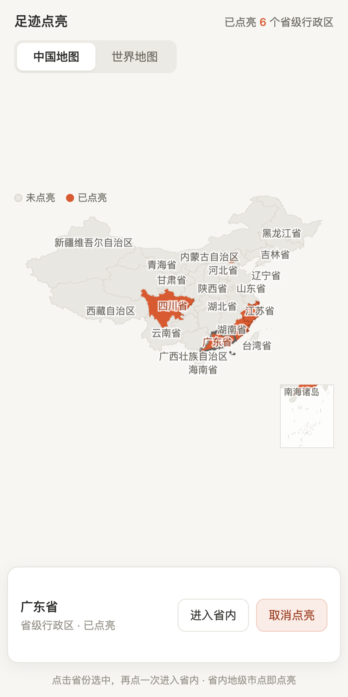
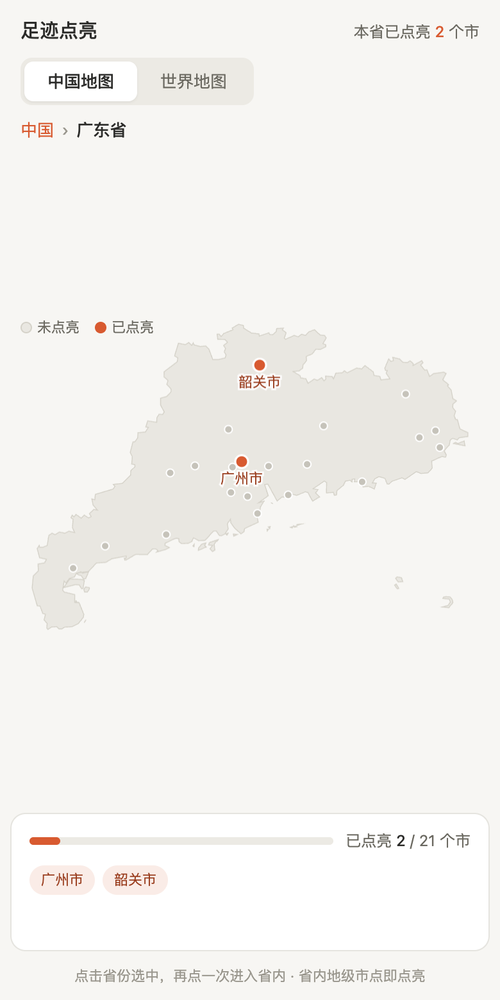
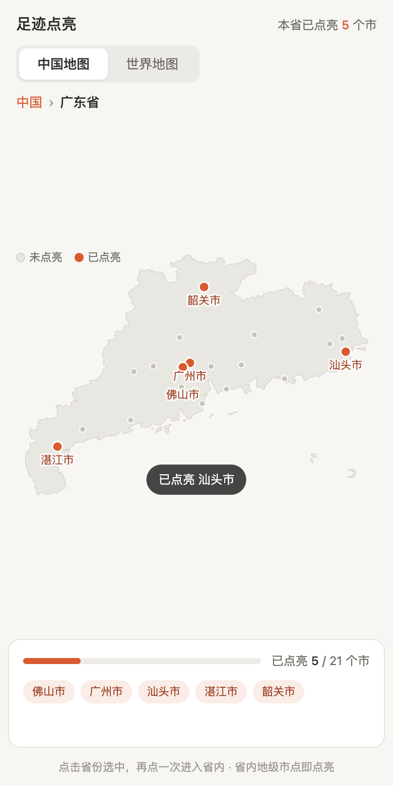
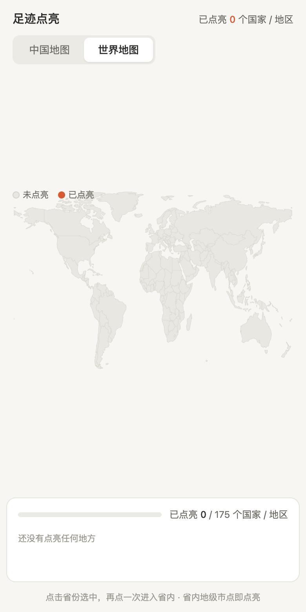
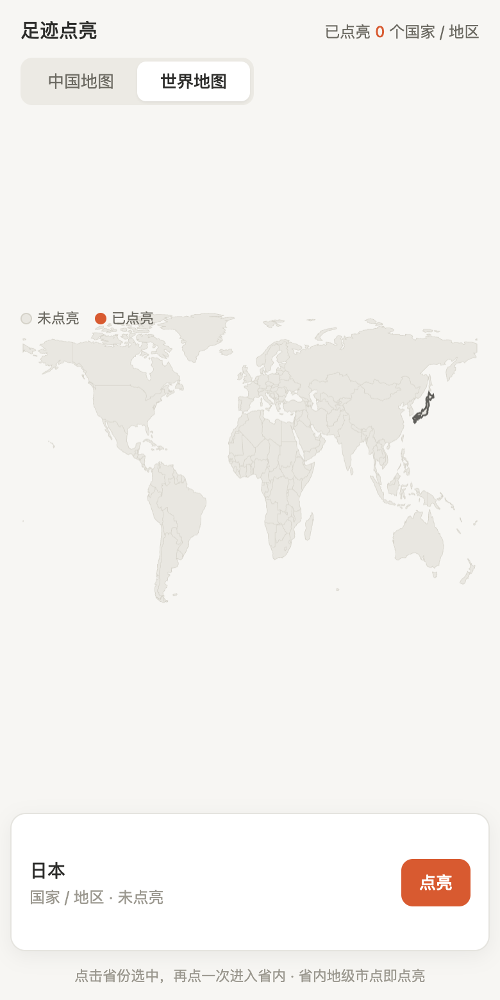
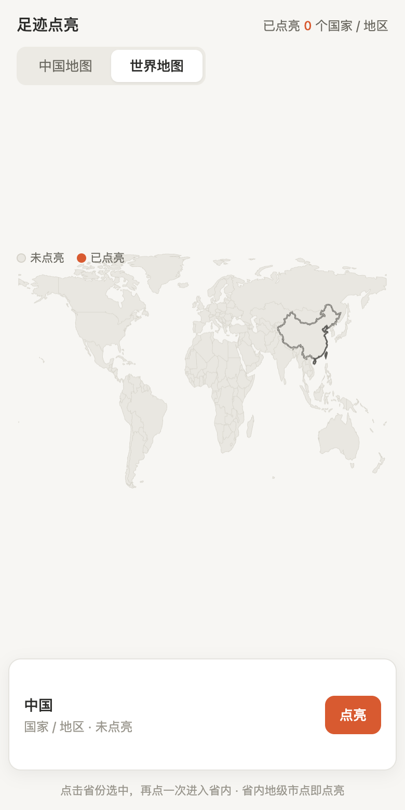

# 足迹点亮地图 · 双端实现方案（H5 + 微信小程序）

[](https://codedogqby.github.io/footprint-map/)
[](./LICENSE)
[](./src/map-core.js)
[](./dist/mapdata.json)

> 一个 23KB 的纯 JS 内核（零依赖）+ 一份 381KB 的抽稀 GeoJSON，同时喂饱 H5 与小程序。
> 不用任何地图 SDK —— 因为这类"点亮图"的本质是**画多边形**，不是**看地图**。

**▶ [在线演示](https://codedogqby.github.io/footprint-map/)** —— 手机浏览器打开可直接点，数据全部在本地，无网络请求。

需求：一套代码同时跑在 **H5** 和 **微信小程序**；能切换 **世界地图 / 中国地图**；中国地图可 **下钻到省**，
省内以 **圆点** 表示地级市并支持点亮；**默认中国地图**；最细行政轮廓只到 **省**。

---

## 效果

| 中国地图（默认） | 选中省份 | 下钻到省 · 城市圆点 | 点亮城市 |
|:---:|:---:|:---:|:---:|
|  |  |  |  |

| 世界地图 | 选中国家 | 点台北归属中国 |
|:---:|:---:|:---:|
|  |  |  |

> 以上截图由 `npm run shots` 自动生成。

---

## 1. 结论先行：不要用地图 SDK，用矢量轮廓自绘

这类"点亮图"的本质是 **画多边形**，不是 **看地图**。

| | 用地图 SDK（腾讯/高德/百度） | 矢量轮廓自绘（本方案） |
|---|---|---|
| 小程序 + H5 复用 | 两端 API 完全不同，要写两套 | 内核 100% 复用 |
| 世界地图 | 各家 SDK 都不做"世界国家轮廓" | GeoJSON 直接支持 |
| 视觉 | 真实瓦片底图会干扰"点亮"的对比度 | 纯色对比，点亮效果最干净 |
| 体积 / 首屏 | 引入 SDK 数百 KB ~ 数 MB | 内核 23KB + 数据 381KB |
| 省市下钻 | 需要额外图层逻辑 | 换一份 GeoJSON 换个 bbox 而已 |

**唯一需要 SDK 的场景**：要做 POI 搜索、真实路线导航、实时定位地图、卫星影像。
这些需求本方案不覆盖，那时再单独用腾讯位置服务（小程序 `map` 组件 / GL JS）做旁路。

---

## 2. 目录结构

```
map-demo/
├── src/map-core.js            ★ 双端共用内核（纯 JS，23KB，零依赖）
├── dist/mapdata.json          ★ 精简后的地图数据（381KB / gzip 118KB）
├── web/index.html             ★ H5 容器（引用上面两个文件，用于真实部署）
├── preview.html               单文件自包含预览（数据已内联，双击即开）
├── index.html                 GitHub Pages 入口（跳转到 preview.html）
├── miniprogram/               ★ 微信小程序容器
│   ├── pages/map/map.{js,wxml,wxss,json}
│   └── utils/                 以下两个文件由 build_preview.py 生成，勿手改
│       ├── map-core.js        从 src/ 复制
│       └── mapdata.js         从 dist/ 转成 CommonJS
├── data/                      原始数据（构建产物，保留以便复现）
│   ├── china_provinces.json       阿里云 DataV 省级轮廓
│   ├── china_city_points.json     各省下级地级市中心点
│   └── world_countries_raw.geojson Natural Earth 110m 国家
├── build_data.py              原始数据 → 精简数据
├── simplify.py                Douglas-Peucker 抽稀 + 精度压缩
├── build_preview.py           ★ 同步内核到小程序 + 打包单文件预览
├── shots.js                   Playwright 自动截图验证（8 个场景）
├── shots/                     截图产物（README 引用）
├── test_kernel.js             Node 冒烟测试（无需浏览器）
├── package.json               仅声明 devDependency playwright
└── LICENSE                     MIT
```

改完 `src/map-core.js` 后跑一次 `python3 build_preview.py`，小程序端和预览页会一起更新。

---

## 3. 双端复用是怎么做到的

内核 `map-core.js` 守住三条硬约束，所以同一份代码能在两端跑：

1. **不碰任何宿主环境** —— 没有 `window` / `document` / `wx`，只接收一个标准 `CanvasRenderingContext2D`。
2. **不用 Path2D** —— 小程序的 canvas 2d 不支持 `Path2D`、`ctx.isPointInPath`。
   命中检测用自研 **射线法**（`pointInRings`），两端行为完全一致。
3. **不依赖网络** —— 数据由容器注入，H5 走 `fetch`，小程序走 `require`。

容器的差异只有三处（各写约 20 行）：

| 环节 | H5 | 微信小程序 |
|---|---|---|
| 取 ctx | `canvas.getContext('2d')` | `createSelectorQuery().fields({node:true})` → `node.getContext('2d')` |
| 高清屏 | `window.devicePixelRatio` | `wx.getWindowInfo().pixelRatio` |
| 触摸 | `pointerup` + `getBoundingClientRect()` | `bindtouchend`，`e.changedTouches[0].x / y` |
| 持久化 | `localStorage` | `wx.setStorageSync` |

---

## 4. 数据方案

### 4.1 三层数据，各管一段

| 层级 | 内容 | 来源 | 体积 |
|---|---|---|---|
| 世界 | 175 个国家轮廓 + 中文名 | Natural Earth 110m | 约 110KB |
| 中国 | 35 个省级行政区轮廓 | 阿里云 DataV GeoAtlas | 约 230KB |
| 省内 | 34 省 × 下级地级市中心点（475 个） | DataV 各省 `_full.json` 的 `properties.center` | 34KB |

关键点：**省内不用地级市轮廓**。DataV 的市级数据里每个 feature 自带 `center` 经纬度，
直接抽出来当点用即可 —— 这正好命中"最小到省、省里用点点亮市"的需求，还省掉 10 倍以上的几何体积。

### 4.2 抽稀：25k 点 → 12k 点

用 Douglas-Peucker（`simplify.py`）：

| 图层 | 阈值 | 点数变化 | 说明 |
|---|---|---|---|
| 中国省级 | `eps=0.02°`（≈2.2km） | 25240 → 12555（50%） | 省级放大约 1px 误差，肉眼无感 |
| 世界国家 | `eps=0.05°` | 9993 → 9220 | 110m 本身就是粗数据 |

再叠加坐标精度压缩（中国 3 位小数、世界 2 位小数）：

```
原始        ≈ 1400 KB
抽稀+压缩   =   381 KB  ← dist/mapdata.json
gzip 后     =   118 KB
```

**小程序包体提醒**：主包上限 2MB。380KB 数据可以放主包，但若项目还有别的资源，
建议把「世界国家数据」拆到 **分包**（`subPackages`），进入世界视图时再加载。

### 4.3 合规处理（必须做，已在数据里落地）

- 中国版图用 **DataV GeoAtlas**，天然含 **台湾省（710000）** 与 **南海诸岛（100000_JD）**。
- 世界地图数据把 Natural Earth 里独立的 "Taiwan" 要素 **合并进中国**，并改名为「中国」。
  验证方式：在世界视图点击台北坐标，返回的是「中国」而不是单独的国家。
- **南海诸岛附图**：中国视图右下角固定绘制一个带边框的小图（`drawSouthSeaInset`）。
  主图按纬度 ≥ 17.5° 裁掉岛礁点，避免主图被南海拉长变形 —— 这也是横版中国标准地图的画法。
- 上线前建议再走一道：以 **自然资源部标准地图服务** 的审图号版本 / 天地图数据为准，
  世界图层尤其注意 藏南、阿克赛钦 等区域的表达。本仓库的世界数据仅用于交互原型。

---

## 5. 交互设计

```
        ┌─ 中国地图（默认）──────────────┐      ┌─ 世界地图 ─────┐
        │ 35 省级轮廓，点击选中          │      │ 175 国家轮廓    │
        │  · 再点同一个省 → 下钻         │ ←→   │ 点击选中        │
        │  · 底部面板 → 点亮 / 进入省内  │      │ 底部面板 → 点亮 │
        └───────────────────────────────┘      └────────────────┘
                     ↓ 下钻
        ┌─ 省内视图 ─────────────────────┐
        │ 省轮廓 + 地级市圆点            │
        │ 点击圆点 → 立即点亮/取消       │
        │ 面包屑 / 返回 → 回到中国       │
        └───────────────────────────────┘
```

- **点选容差**：香港、澳门这类区域面积太小，手指点不准。`hitTest` 在精确命中失败后，
  会退化为"距离要素中心点 10px 内也算命中"。
- **label 防遮挡**：省级视图只画 34 个名字；省内视图城市数 ≤ 18 时才画全部标签，
  超过（如重庆 38 个区县）只画已点亮的，避免糊成一团。
- **悬停**：H5 端支持鼠标悬停高亮描边，小程序端自动跳过。

---

## 6. 怎么跑

### H5
```bash
cd map-demo
python3 -m http.server 8080
# 打开 http://localhost:8080/web/index.html
```
> 直接双击 `web/index.html` 走 `file://` 时，`fetch('../dist/mapdata.json')` 会被浏览器拦截 ——
> 这种情况请打开 `preview.html`（数据已内联，无网络请求）。

### 微信小程序
1. 微信开发者工具 → 导入项目 → 选择 `map-demo/miniprogram` 目录
2. 编译即可（AppID 可用测试号）
3. 真机预览：`canvas type="2d"` 在真机上的 `pixelRatio` 与开发者工具不同，内核已按运行时取值

### 内核自测（无浏览器，零依赖）
```bash
npm test          # 等价于 node test_kernel.js
```
会校验：北京/广州/乌鲁木齐/台北/香港/拉萨 的省份命中、世界视图 5 国命中、
广东省下钻后首市命中、三种视图的绘制不抛异常、数据导入导出往返。

### 自动截图回归（需要浏览器）
```bash
npm install
npx playwright install chromium
npm run shots     # 跑 8 个场景，写入 shots/，有 console error 则退出码非 0
```
> 若本机已有 Chrome 内核，可用 `CHROME_PATH=/path/to/chrome npm run shots` 跳过下载。

### 只改了地图数据
```bash
python3 build_data.py       # 原始 → 基础数据
python3 simplify.py         # 抽稀 + 精度压缩 → dist/mapdata.json
python3 build_preview.py    # 同步到小程序 + 重新打包 preview.html
```

---

## 7. 踩过的坑（都已修，复刻时注意）

| 现象 | 原因 | 解法 |
|---|---|---|
| 点第一下弹出面板后，**再点同一个省点不中** | 面板用 `display:none → flex` 切换，出现时把地图顶上去，第二次点击落点已经错位 | 面板与进度卡都改成 **绝对定位贴底**，用 `visibility` 切换，永不参与文档流 |
| 北京/天津/上海、福建/台湾 标签糊成一团，台湾省标签被挤掉 | 朴素做法"撞上就跳过"，谁先画谁赢 | 每个标签按 `[居中, 上, 下, 左, 右, 四个斜角…]` 依次试位；已点亮/面积大的优先占位 |
| 南海诸岛附图压住了台湾省和福建省 | 附图覆盖在画布右下角，但地图是**纵向居中**的，右下角正好是陆地 | 内核加 `insetHeight()`，主图只在「画布高度 − 附图高度」的区域里做 fit |
| 竖屏里地图只有 200px 高，下面一大片留白 | 世界 2.6:1、中国 1.7:1，手机屏是 0.5:1，等比缩放必然宽度受限 | 内核暴露 `preferredHeight(w)`，容器按地图比例决定画布高度；世界视图允许 ≤1.75 倍纵向拉伸换取可点面积 |
| 纽约这种海岸线上的点在世界视图点不中 | Natural Earth 110m 海岸线本来就是粗的，再抽稀还会外移 | 精确命中失败后，退化到"距要素中心 10px 内也算"（对小国、港澳尤其有用） |

## 8. 性能

- **绘制**：每帧投影 12k 点（中国）/ 9k 点（世界），实测在 60fps 无压力。
  填充与描边分两遍、投影结果缓存复用，避免重复计算。
- **命中**：射线法遍历所有环。中国视图约 12k 边，单次点击 < 3ms。
- **首帧**：数据解析 380KB JSON 约 30–60ms，可接受；若嫌慢可换成 TopoJSON 量化。

---

## 9. 可以继续加的东西

| 需求 | 做法 |
|---|---|
| 城市搜索定位 | 用上面的 475 个点名建一张索引，前端模糊匹配后 `project()` 定位 |
| 点亮进度排行榜 | 点亮数据上行到后端，按省/市聚合 |
| 分享海报 | H5 用 `canvas.toDataURL()`；小程序用 `wx.canvasToTempFilePath` + 分享封面 |
| 区县下钻 | DataV 再下一级 `{adcode}_full.json`，内核不用改，换数据即可 |
| 导入高德/微信运动足迹 | 解析轨迹点在客户端做一次 point-in-polygon 反查省市 |
| 世界城市级点亮 | 加 GeoNames `cities15000`（约 2.5 万个城镇点）作为世界视图的圆点层 |

---

## 10. 一句话总结

**一个 23KB 的纯 JS 内核 + 一份 381KB 的抽稀 GeoJSON，就能同时喂饱 H5 和小程序。**
难点不在渲染，在数据：抽稀到什么程度、省级轮廓从哪来、以及中国版图那几个必须画对的地方。

---

## 11. 数据来源与许可

| 数据 | 来源 | 许可 |
|---|---|---|
| 中国省级轮廓、地级市中心点 | [阿里云 DataV GeoAtlas](https://geo.datav.aliyun.com/areas_v3/bound/) | 阿里云数据源，免费用于可视化 |
| 世界各国轮廓 | [Natural Earth](https://www.naturalearthdata.com/) 110m Admin 0 | Public Domain |
| 中文国名 | Natural Earth `NAME_ZH` 字段 | Public Domain |

代码以 [MIT](./LICENSE) 许可发布。

> **免责声明**：本仓库的世界图层为交互原型用途，中国版图数据未经**自然资源部标准地图**审核。
> 若要上线面向公众的产品，请以[标准地图服务](http://bzdt.ch.mnr.gov.cn/)或天地图数据自行校验并替换，
> 世界图层尤其注意藏南、阿克赛钦等区域的表达。详见 [4.3 合规处理](#43-合规处理必须做已在数据里落地)。
